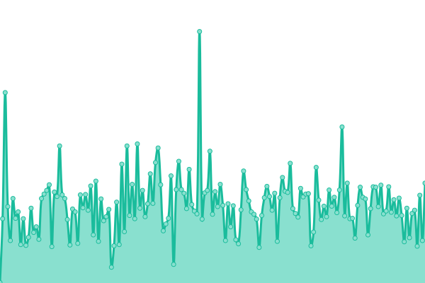
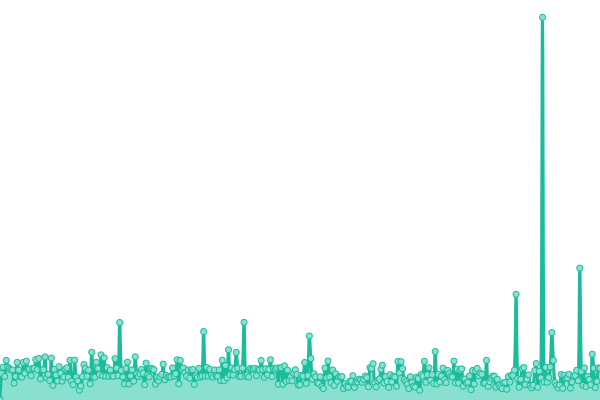

# [📈 Live Status](https://status.leech.ie): <!--live status--> **🟩 All systems operational**

This repository contains the open-source uptime monitor and status page for [jamiew0w](jamie.ie), powered by [Upptime](https://github.com/upptime/upptime).

With [Upptime](https://upptime.js.org), you can get your own unlimited and free uptime monitor and status page, powered entirely by a GitHub repository. We use [Issues](https://github.com/jamiew0w/status.leech.ie/issues) as incident reports, [Actions](https://github.com/jamiew0w/status.leech.ie/actions) as uptime monitors, and [Pages](https://status.leech.ie) for the status page.

<!--start: status pages-->
<!-- This summary is generated by Upptime (https://github.com/upptime/upptime) -->
<!-- Do not edit this manually, your changes will be overwritten -->
<!-- prettier-ignore -->
| URL | Status | History | Response Time | Uptime |
| --- | ------ | ------- | ------------- | ------ |
|  [leech.ie](https://leech.ie) | 🟩 Up | [leech-ie.yml](https://github.com/jamiew0w/status.leech.ie/commits/HEAD/history/leech-ie.yml) | 

 304ms
     
 | 

<a href="https://status.leech.ie/history/leech-ie">100.00%</a>
    

|  [t1.leech.ie](http://t1.leech.ie) | 🟩 Up | [t1-leech-ie.yml](https://github.com/jamiew0w/status.leech.ie/commits/HEAD/history/t1-leech-ie.yml) | 

 474ms
     
 | 

<a href="https://status.leech.ie/history/t1-leech-ie">100.00%</a>
    

|  [t2.leech.ie](http://t2.leech.ie) | 🟩 Up | [t2-leech-ie.yml](https://github.com/jamiew0w/status.leech.ie/commits/HEAD/history/t2-leech-ie.yml) | 

 288ms
     
 | 

<a href="https://status.leech.ie/history/t2-leech-ie">100.00%</a>
    

|  [t3.leech.ie](http://t3.leech.ie) | 🟩 Up | [t3-leech-ie.yml](https://github.com/jamiew0w/status.leech.ie/commits/HEAD/history/t3-leech-ie.yml) | 

 329ms
     
 | 

<a href="https://status.leech.ie/history/t3-leech-ie">100.00%</a>
    

<!--end: status pages-->

[**Visit our status website →**](https://status.leech.ie)

## 📄 License

- Powered by: [Upptime](https://github.com/upptime/upptime)
- Code: [MIT](./LICENSE) © [jamiew0w](jamie.ie)
- Data in the `./history` directory: [Open Database License](https://opendatacommons.org/licenses/odbl/1-0/)
